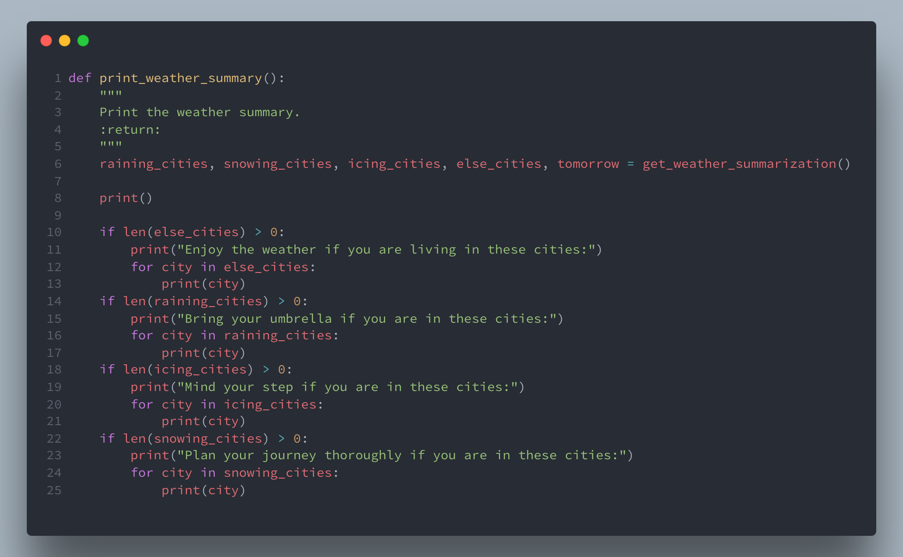
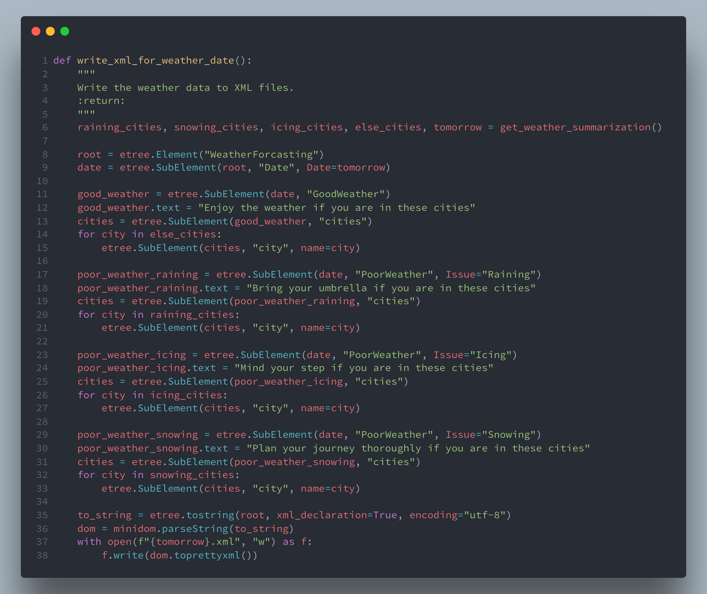
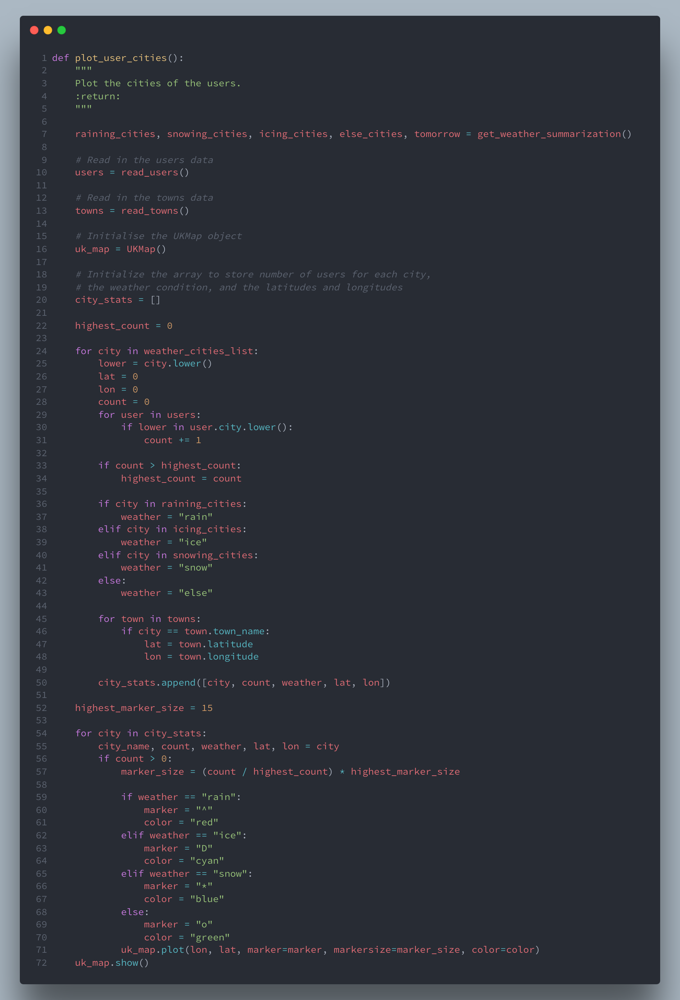
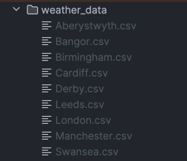
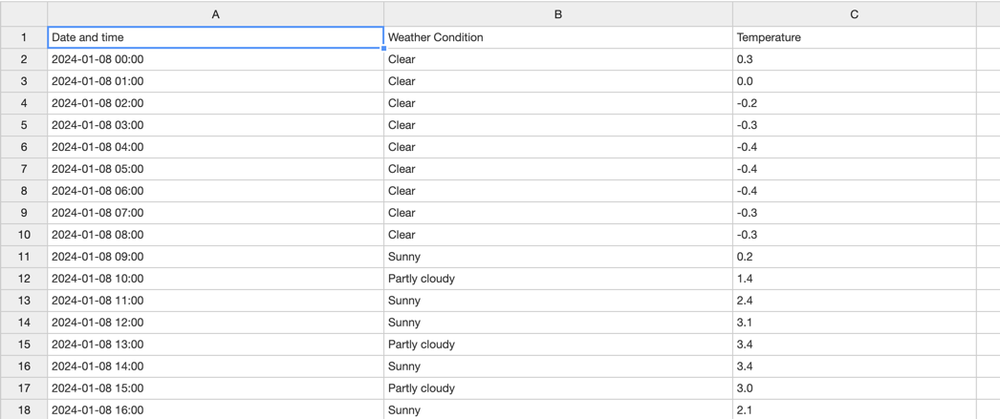
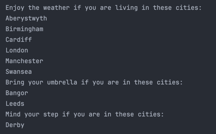
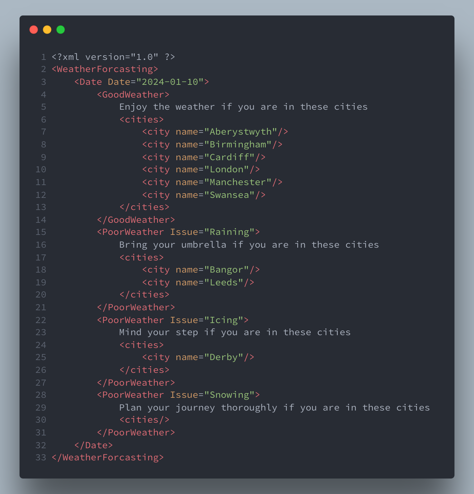
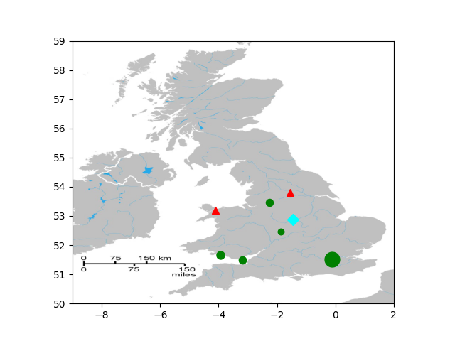

# Executive Summary

This report delineates the development of a Python program for weather forecasting. The program incorporates six major
tasks, the first one includes plotting towns in England and Wales on UK Map. The second one encompasses accessing
weather data using API. Similarly, the third one includes extracting and storing information from online data. The
fourth one includes summarizing key information from online data. The fifth one includes presenting data in the XML
format. Finally, the sixth task includes plotting cities showing weather conditions and size of subscribed users.

# Technical Overview 

For the technical part, let's cover what we are provided with:
- A file `latlon.csv` that contains latitudes and longitudes for towns in England and Wales. Each line contains 3 fields: town name, latitude and longitude.
- A module `UKMap.py`, which provides a class UKMap with handy functions.
- An image `Gb4dot_merged_mapcolors.png`, is the UK map in which the plot will be made. This image is required to run UKMap.py.
- A file `users.csv` that shows the users in the UK who have signed up to receive weather information.

## Importing the required modules

The program imports the following modules:

- `UKMap` from `UKMap.py` module provided with the assignment.
- `requests` to make HTTP requests.
- `json` to parse JSON data.
- `os` to interact with the operating system.
- `datetime` to work with dates and times.
- `etree` from `lxml` to create and parse XML data.
- `minidom` from `xml.dom` to format XML data.

## Defining the constants/variables

The program defines the following constants/variables:

- `lat_lon_file`: the path to the file containing the towns data
- `users_file`: the path to the file containing the users data
- `weather_api_key`: the API key for the weather API (Currently empty to avoid misuse. Presented in the code)
- `weather_api_base_url`: the base URL for the weather API
- `weather_cities_list`: the list of cities for which the weather forecast is to be fetched
- `csv_output_folder`: the folder where the CSV weather data will be stored

## Defining the main function

The main function is defined as follows:

The main function calls the following functions:
- `plot_specific_towns` to plot the towns in the map
- `fetch_weather` to fetch the weather data from weatherapi.com and write to csv files
- `print_weather_summary` to print the weather forecast summary
- `write_xml_for_weather_date` to write the weather data to XML files
- `plot_user_cities` to plot the cities of the users who subscribed to the weather forecast service

## Defining the classes

The program defines the following classes:

### LatLon

The `LatLon` class is defined as follows:

This class is used to store the data of a town. The `LatLon` class has the following methods:
- `__init__`: the constructor of the class. It takes the following parameters:
    - `town_name`: the name of the town
    - `latitude`: the latitude of the town
    - `longitude`: the longitude of the town
- `__str__`: returns a string representation of the town

### WeatherData

The `WeatherData` class is defined as follows:

This class is used to store the weather data of a town. The `WeatherData` class has the following methods:
- `__init__`: the constructor of the class. It takes the following parameters:
    - `date_time`: the date and time of the weather data
    - `condition`: the weather condition
    - `temperature`: the temperature in Celsius

### Name

The `Name` class is defined as follows:

This class is used to store the name of a user. The `Name` class has the following methods:

- `__init__`: the constructor of the class. It takes the following parameters:
    - `title`: the title of the name
    - `first`: the first name
    - `last`: the last name
- `__str__`: returns a string representation of the name

### User

The `User` class is defined as follows:

This class is used to store the data of a user. The `User` class has the following methods:

- `__init__`: the constructor of the class. It takes the following parameters:
    - `name`: the name of the user (an instance of the `Name` class)
    - `city`: the city of the user
    - `email`: the email of the user
    - `dob`: the date of birth of the user
    - `phone`: the phone number of the user
- `__str__`: returns a string representation of the user

## Defining the required functions

The program defines the following functions:

### read_towns

The `read_towns` function is defined as follows:

This function reads the towns data from `latlon.csv` file and returns a list of `LatLon` objects.
The steps followed by this function are as follows:
- Open the `latlon.csv` file.
- For each line in the file:
    - Split the line by comma.
    - Create a `LatLon` object with the town name, latitude and longitude.
    - Append the `LatLon` object to the list of towns.
- Return the list of towns. 
- Handle any exceptions.

### read_users

The `read_users` function is defined as follows:

This function reads the users data from `users.csv` file and returns a list of `User` objects.
The steps followed by this function are as follows:
- Open the `users.csv` file.
- For each line in the file:
    - Split the line by comma.
    - Create a `User` object with the name, city, email, date of birth and phone number.
    - Append the `User` object to the list of users.  
    - Return the list of users.
- Handle any exceptions.
- The `Name` object is created by passing the title, first name and last name to the constructor of the `Name` class.

### get_weather_summarization

The `get_weather_summarization` function is defined as follows:

This function summarizes the key information from the weather data and returns the list of cities and tomorrow's date.
The steps followed by this function are as follows:
- Get tomorrow's date with the format `YYYY-MM-DD`.
- For each city in the list of cities:
    - Open the CSV file for that city.
    - For each line in the CSV file:
        - If the line starts with tomorrow's date:
            - Extract the date and time, weather condition and temperature from the line.
            - If the weather condition contains "rain" or "drizzle", increment the number of rainy hours.
            - If the weather condition contains "snow" or "blizzard", increment the number of snowy hours.
            - If the temperature is less than 0, increment the number of icy hours.
    - If the number of rainy hours is at least 6, add the city to the list of raining cities.
    - If the number of snowy hours is at least 4, add the city to the list of snowing cities.
    - If the number of icy hours is at least 8, add the city to the list of icing cities.
    - Otherwise, add the city to the list of else cities.
    - Close the CSV file.
    - Return the list of cities and tomorrow's date.
- Handle any exceptions.

### at_least

The `at_least` function is defined as follows:

This function calculates the number needed to fulfil the at least condition.

### more_than

The `more_than` function is defined as follows:

This function calculates the number needed to fulfil the more than condition.

## Task 1 - Plotting Towns in England and Wales on UK Map

The first task includes plotting towns in England and Wales on UK Map. The program reads the towns data from `latlon.csv` file and plots those towns on a UKMap which fulfil any of the following criteria:
- The town name starts with A, B, C, L or M.
- The town name ends with “bury” or “ampton”.
- The town name is Aberystwyth, Birmingham, Cardiff or London.

This task uses the `plot_specific_towns` function to plot the towns on the map. The definition of the `plot_specific_towns` function is as follows:

The `plot_specific_towns` function reads the towns data from `latlon.csv` file and plots those towns on a UKMap which fulfil any of the given criteria. The steps followed by this function are as follows:
- Read the towns data from `latlon.csv` file.
- Initialise the UKMap object.
- For each town in the list of towns:
    - If the town name is Aberystwyth, Birmingham, Cardiff or London:
        - Plot the town on the map with the marker `o`, marker size `6` and color `green`.
    - Otherwise, if the town name starts with A, B, C, L or M or the town name ends with “bury” or “ampton”:
        - Plot the town on the map with the marker `.`, marker size `1` and color `red`.
- Show the map.

## Task 2 - Accessing weather data using API

The second task includes accessing weather data using API. The program accesses the hourly weather forecast of 3 days at 9 cities using WeatherAPI. The weather forecast data covers 72 hours (i.e., 24 hours x 3 days) for each city with a forecasting interval of one hour.

The `fetch_weather_data` function is used to fetch the weather data from weatherapi.com. The definition of the `fetch_weather_data` function is as follows:

This function fetches the weather data from weatherapi.com and returns a list of `WeatherData` objects.

This function takes the following parameters:
- `latitude`: the latitude of the city
- `longitude`: the longitude of the city
- `tp`: the time period interval for which the weather data is to be fetched (in hours)
- `days`: the number of days for which the weather data is to be fetched

The steps followed by this function are as follows:
- Construct the URL for the API call.
- Make the API call.
- Parse the JSON response.
- Extract the required data from the JSON response.
- Return the list of `WeatherData` objects.
- Handle any exceptions.

## Task 3 - Extracting and Storing Information from Online Data

The third task includes extracting and storing weather data in `csv` file. The program accesses the hourly weather forecast of 3 days at 9 cities using WeatherAPI. The weather forecast data covers 72 hours (i.e., 24 hours x 3 days) for each city with a forecasting interval of one hour.

This task uses the `fetch_weather` function to fetch the weather data from weatherapi.com and write to csv files. The definition of the `fetch_weather` function is as follows:

The `fetch_weather` function fetches the weather data from weatherapi.com and writes to csv files. The steps followed by this function are as follows:
- Initialise the list of cities with latitude and longitude.
- For each city in the list of towns:
    - If the city is in the list of weather cities:
        - Append the city name, latitude and longitude to the list of cities with latitude and longitude.
- If the output folder does not exist:
  - Create the output folder.
- For each city in the list of cities with latitude and longitude:
  - Get the city name, latitude and longitude.
  - Fetch the weather data for the city.
  - If the weather data is not empty:
      - Open the CSV file for the city.
      - Print the currently processing city. (currently commented out)
      - Write the header to the CSV file.
      - For each weather data in the weather data:
          - Write the weather data to the CSV file.
      - Close the CSV file.

## Task 4 - Summarizing key information from online data

The fourth task includes summarizing key information from online data. The program divides the 9 cities into four categories: raining, snowing, icing and else based on the weather condition and temperature in the next day.

This task uses the `print_weather_summary` function to print the weather forecast summary. The definition of the `print_weather_summary` function is as follows:

The `print_weather_summary` function prints the weather forecast summary. The steps followed by this function are as follows:

- Get the list of cities and tomorrow's date from the `get_weather_summarization` function.
- If the list of each cities is not empty:
    - Print the message according to the weather forecast summary.
    - For each city in the list of else cities:
        - Print the city.
- If the list of raining cities is empty:
    - Skip the message.
    - Skip the list of cities.

## Task 5 - Presenting data in the XML format

The fifth task includes presenting data in the XML format. The program converts the message (from Task 4) into an easy-to-interpret XML form and saves as `<date>.xml`.

This task uses the `write_xml_for_weather_date` function to write the weather data to XML files. The definition of the `write_xml_for_weather_date` function is as follows:

The `write_xml_for_weather_date` function writes the weather data to XML files. The steps followed by this function are as follows:
- Get the list of cities and tomorrow's date from the `get_weather_summarization` function.
- Initialise the root element.
- Initialise the date element with the date attribute.
- For "Good Weather":
    - Initialise the weather element.
    - The text of the weather element is set to "Enjoy the weather if you are in these cities".
    - Initialise the cities element inside the weather element.
    - For each city in the list of else cities:
        - Initialise the city element inside the cities element.
        - Set the name attribute of the city element to the city.
        - Append the city element to the cities element.
    - Append the cities element to the weather element.
- For "Poor Weather with 'Raining' issue":
    - Initialise the weather element.
    - The text of the weather element is set to "Bring your umbrella if you are in these cities".
    - Initialise the cities element inside the weather element.
    - For each city in the list of raining cities:
        - Initialise the city element inside the cities element.
        - Set the name attribute of the city element to the city.
        - Append the city element to the cities element.
    - Append the cities element to the weather element.
- For "Poor Weather with 'Icing' issue":
    - Initialise the weather element.
    - The text of the weather element is set to "Mind your step if you are in these cities".
    - Initialise the cities element inside the weather element.
    - For each city in the list of icing cities:
        - Initialise the city element inside the cities element.
        - Set the name attribute of the city element to the city.
        - Append the city element to the cities element.
    - Append the cities element to the weather element.
- For "Poor Weather with 'Snowing' issue":
    - Initialise the weather element.
    - The text of the weather element is set to "Plan your journey thoroughly if you are in these cities".
    - Initialise the cities element inside the weather element.
    - For each city in the list of snowing cities:
        - Initialise the city element inside the cities element.
        - Set the name attribute of the city element to the city.
        - Append the city element to the cities element.
    - Append the cities element to the weather element.
- Initialise the XML document.
- Set the root element of the XML document to the root element.
- Convert the XML document to a string.
- Format the XML string.
- Write the XML string to the XML file.

## Task 6 - Plotting Cities Showing Weather Conditions and Size of Subscribed Users

The sixth task includes plotting cities showing weather conditions and size of subscribed users. The program plots all 9 cities from `latlon.csv` on UK map using UKMap.py.

This task uses the `plot_user_cities` function to plot the cities of the users who subscribed to the weather forecast service. The definition of the `plot_user_cities` function is as follows:

The `plot_user_cities` function plots all 9 cities from `latlon.csv` on UK map using UKMap.py. The steps followed by this function are as follows:
- Get the list of cities and tomorrow's date from the `get_weather_summarization` function.
- Read the users data from `users.csv` file using the `read_users` function.
- Read the towns data from `latlon.csv` file using the `read_towns` function.
- Initialise the UKMap object.
- Initialise the array to store number of users for each city, the weather condition, and the latitudes and longitudes.
- Initialise the highest count to 0. It will be used to calculate the marker size.
- For each city in the list of weather cities:
    - Initialise the count to 0.
    - For each user in the list of users:
        - If the city is in the user's city:
            - Increment the count.
    - If the count is greater than the highest count:
        - Set the highest count to the count.
    - If the city is in the raining cities:
        - Set the weather to "rain".
    - Otherwise, if the city is in the icing cities:
        - Set the weather to "ice".
    - Otherwise, if the city is in the snowing cities:
        - Set the weather to "snow".
    - Otherwise:
        - Set the weather to "else".
    - For each town in the list of towns:
        - If the city is the town name:
            - Set the latitude and longitude to the town's latitude and longitude.
    - Append the city name, count, weather, latitude and longitude to the city stats array.
- Initialise the highest marker size to 15. It will be used to calculate the marker size.
- For each city in the city stats array:
    - Get the city name, count, weather, latitude and longitude.
    - If the count is greater than 0:
        - Calculate the marker size.
        - If the weather is "rain":
            - Set the marker to "^".
            - Set the color to "red".
        - Otherwise, if the weather is "ice":
            - Set the marker to "D".
            - Set the color to "cyan".
        - Otherwise, if the weather is "snow":
            - Set the marker to "*".
            - Set the color to "blue".
        - Otherwise:
            - Set the marker to "o".
            - Set the color to "green".
        - Plot the city on the map with the marker, marker size and color.
- Show the map.

# Software Testing

## Task 1

The `plot_specific_towns` function is expected to plot the towns in the map. The output of this function is as follows:

Here, the towns Aberystwyth, Birmingham, Cardiff and London are plotted with a green circle of size 6. The towns starting with A, B, C, L or M or ending with “bury” or “ampton” are plotted with a red dot of size 1.

The possible errors in this task occurs with the plotting. The plotting of the towns can be distorted due to Earth being spherical and the map being two-dimensional.

## Task 2

The `fetch_weather_data` function is expected to fetch the weather data from weatherapi.com and return a list of `WeatherData` objects. The output of this function is as follows:

Here, the weather data for the city Aberystwyth is fetched and printed. The weather data is fetched for 3 days with a forecasting interval of 1 hour.

## Task 3

The `fetch_weather` function is expected to fetch the weather data from weatherapi.com and write to csv files. The output of this function is as follows:

The files are stored in the `weather_data` folder. It contains the CSV files for each city.

The preview of `Aberystwyth.csv` among the CSV files is as follows:

The format of the CSV files is: `Date and time`, `Weather condition`, `Temperature`

## Task 4

The `print_weather_summary` function is expected to print the weather forecast summary. The output of this function is as follows:

Here:
- The cities Aberystwyth, Birmingham, Cardiff, London, Manchester and Swansea are in the else category.
- The cities Bangor and Leeds are in the raining category.
- The city Derby is in the icing category.
- There are no cities in the snowing category.

## Task 5

The `write_xml_for_weather_date` function is expected to write the weather data to XML files. The output of this function is as follows:

This test was performed on `2024-01-09`. So, the XML file is named `2024-01-10.xml` and contains weather segmentation for `January 10, 2024`.

## Task 6

The `plot_user_cities` function is expected to plot the cities of the users who subscribed to the weather forecast service. The output of this function is as follows:

Here, the plotting is done according to the criteria and the number of users subscribed to the weather forecast service.

# Reflections and Future Work

The program could be improved and extended in the following ways:

- **Dynamic cities**: The program could be improved by making the cities dynamic. Currently, the cities are hardcoded in the program. The program could be improved by making the cities dynamic. The program could read the cities from a file or database and plot those cities on the map.
- **More weather conditions**: The program could be improved by adding more weather conditions. Currently, the program only checks for rain, snow and ice. The program could be improved by adding more weather conditions and checking for those weather conditions.
- **Improved way of storing weather data**: Currently, the program stores the weather data in CSV files. The program could be improved by storing the weather data in a database.
- **Broadcasting the weather forecast**: Currently, the program only prints the weather forecast summary. The program could be improved by broadcasting the weather forecast summary to the users who subscribed to the weather forecast service.
- **More user-friendly**: Currently, the program runs and prints the output in console. The program could be improved by making it more user-friendly. The program could be improved by adding a GUI and making it more interactive.
- **Error handling**: Currently, the program does not handle errors. The program could be improved by handling errors. The program could be improved by handling errors and displaying appropriate error messages to the user.
- **Performance**: Currently, the program handles a small amount of data. The program could be improved by handling a large amount of data. This could be done by optimising the code and making it more efficient.