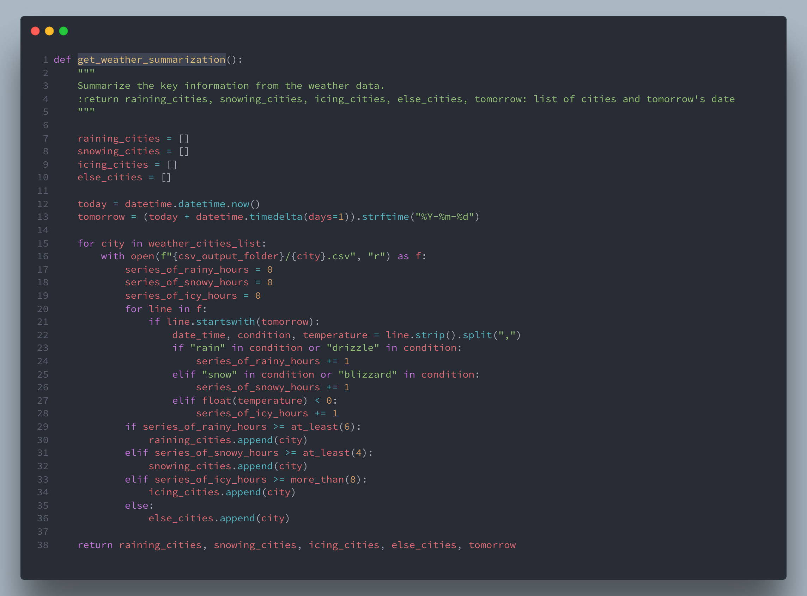
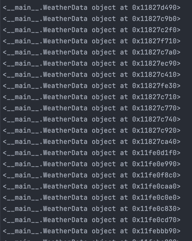

# The Report

[//]: # (2.1 Programming)

[//]: # (Code quality: Make sure all the code you are going to write will be available as reusable )

[//]: # (functions: at least one function for each question you have answered. Your functions should )

[//]: # (take parameters/arguments and should return values. Add a main function which )

[//]: # (demonstrates how to use your other functions. Your code should be well commented, well )

[//]: # (tested, well documented, with proper exception handling and should be able to identify )

[//]: # (incorrect input. Your code should be written elegantly and should produce the correct output. )

[//]: # (The marks for each task &#40;mentioned below&#41; are also associated to code quality.)

[//]: # (Part 1: UK Map)

[//]: # (Task 1: [10 marks] Plotting Towns in England and Wales on UK Map)

[//]: # (You are provided a file called latlon.csv that contains latitudes and longitudes for towns )

[//]: # (in England and Wales. Each line contains 3 fields: town name, latitude and )

[//]: # (longitude. You are also given a module UKMap.py, which provides a class UKMap with )

[//]: # (handy functions &#40;note that an image Gb4dot_merged_mapcolors.png, provided on )

[//]: # (Blackboard with assignment 2 resources, is required to run UKMap.py&#41;. )

[//]: # (Write a Python function plot_specific_towns to read in the towns data &#40;from )

[//]: # (latlon.csv&#41; and plot those towns on a UKMap which fulfil any of the following criteria.)

[//]: # (• The town name starts with A, B, C, L or M.)

[//]: # (• The town name ends with “bury” or “ampton”. )

[//]: # (You must make sure that Aberystwyth, Birmingham, Cardiff and London are easily found on )

[//]: # (the map, i.e., choose a different marker and marker size for them or perhaps annotate them. )

[//]: # (Test your code and demonstrate that you are confident that it is producing a correct plot. Due )

[//]: # (to the fact that the Earth is spherical and maps are two-dimensional, there will be some )

[//]: # (distortion when plotting locations. For instance, you may find that some locations fall slightly )

[//]: # (below the south coast.)

[//]: # (Part 2: Weather)

[//]: # (This part of assignment requires you to develop programs which automatically access )

[//]: # (weather forecasts of the next five days of 9 cities in England and Wales, and provide general )

[//]: # (suggestions to the residents in these cities. The 9 cities considered in this assignment include:)

[//]: # (Aberystwyth Bangor Birmingham)

[//]: # (Cardiff Derby Leeds)

[//]: # (London Manchester Swansea)

[//]: # (In this part, you are asked to perform the following tasks:)

[//]: # (• Automatically access online data;)

[//]: # (• Extract, process and store key information from online data;)

[//]: # (• Present the key information in XML form elegantly; • Plot the cities on UK Map indicating different weather conditions and indicating which )

[//]: # (cities have more subscribed users than users.)

[//]: # (You will be using the free weather API from WeatherAPI to get access to the weather )

[//]: # (forecast data. The link to WeatherAPI is https://www.weatherapi.com. In particular, you )

[//]: # (will be using the 14 day weather forecast API from WeatherAPI. Its documentation is )

[//]: # (available at https://www.weatherapi.com/docs/. You should fetch the temperature in Celcius)

[//]: # (for both APIs.)

[//]: # (You need to first register with WeatherAPI before using its API. Please use the free option )

[//]: # (while registering on the website. Once you complete the registration, you will be able to get )

[//]: # (your API key by clicking My Account. )

[//]: # (This API key is a combination of 31 alphanumeric characters in a similar form as follow:)

[//]: # (2edb***********************2805)

[//]: # (Please provide your API key in the submission so that your program can work properly.)

[//]: # (When you will use 14 day weather forecast API from WeatherAPI, we are mainly interested )

[//]: # (in time &#40;datetime&#41;, temp_c &#40;temperature&#41; and condition->text &#40;weather condition&#41;)

[//]: # (attributes of hourly forecast. You can find them under forecast->forecastday-)

[//]: # (>hour->time &#40;for datetime&#41;, forecast->forecastday->hour->temp_c &#40;for )

[//]: # (temperature&#41; and forecast->forecastday->hour->condition->text &#40;for )

[//]: # (weather condition&#41; for each hour.)

[//]: # (Task 2: [10 marks] Accessing weather data using API )

[//]: # (Write a program that can access the hourly weather forecast of 3 days at 9 cities &#40;mentioned )

[//]: # (above&#41; using WeatherAPI. The weather forecast data should cover 72 hours &#40;i.e., 24 hours )

[//]: # (x 3 days&#41; for each city with a forecasting interval of one hour. )

[//]: # (Task 3: [15 marks] Extracting and storing information from online data)

[//]: # (Write a program that processes weather forecast data obtained from WeatherAPI)

[//]: # (&#40;obtained in Task 1&#41; so that only the information of datetime, weather condition and )

[//]: # (temperature is stored in csv files. The program should store the extracted forecast of 3 days )

[//]: # (at 9 cities into 9 individual csv files &#40;one csv file per city&#41; in a similar form as mentioned in the )

[//]: # (example below in Table 1.)

[//]: # (For each csv file, name it as `<city name>.csv. For example, if the csv file stores the information )

[//]: # (extract at Aberystwyth, name the csv file as Aberystwyth.csv.)

[//]: # (Table 1. Example for format of storing data into csv files.)

[//]: # (Date and time Weather condition Temperature)

[//]: # (2023-11-02 00:00 Moderate rain 7.4)

[//]: # (2023-11-02 01:00 Light rain 8.0)

[//]: # (2023-11-02 02:00 Light rain 8.7)

[//]: # (… … …)

[//]: # (2023-11-04 23:00 Mist 7.2)

[//]: # (Task 4: [20 marks] Summarizing key information from online data)

[//]: # (Write a program that divides the 9 cities into four categories: raining, snowing, icing)

[//]: # (and else based on the weather condition and temperature in the next day &#40;e.g., if today is )

[//]: # (2023-11-02, the program should only consider the weather forecast data covering the period )

[//]: # (from 2023-11-03 00:00:00 to 2023-11-03 23:59:59&#41; and prints suggestion&#40;s&#41; for the citizens in )

[//]: # (the console following the template given below. )

[//]: # (At a time, a city can appear in one of the four categories based on the following criteria:)

[//]: # (• A city will be categorised as raining if the value of weather condition )

[//]: # (&#40;condition->text&#41; contains "rain" or "drizzle" for at least six hours )

[//]: # (between the time period from 06:00:00 to 23:59:59. )

[//]: # (• Otherwise, a city will be categorized as snowing if the value of weather condition )

[//]: # (&#40;condition->text&#41; contains "snow" or "blizzard" for at least four hours )

[//]: # (between the time period from 00:00:00 to 23:59:59. )

[//]: # (• Otherwise, a city will be categorized as icing if the temperature is below 0 Celsius )

[//]: # (degree for more than eight hours between the time period from 00:00:00 to 23:59:59. )

[//]: # (• Otherwise, a city belongs to the category else.)

[//]: # (Based on the categories that the 9 cities belong to, the program should print a suggestion )

[//]: # (message on the console for the citizens living in the 9 cities. For the cities belonging to the )

[//]: # (category raining, citizens should receive a suggestion of “Bring your umbrella”. For the )

[//]: # (cities belonging to the category icing, citizens should receive a suggestion of “Mind your )

[//]: # (step” as water on the floor may get frozen. For the cities belonging to the category snowing, )

[//]: # (citizens should receive a suggestion of “Plan your journey thoroughly”. For the cities )

[//]: # (belonging to the category else, citizens should receive a suggestion of “Enjoy the weather”. )

[//]: # (The template of the message is given as follows &#40;“XXXXXXXXXX” is a city name&#41;. )

[//]: # (Enjoy the weather if you are living in these cities: )

[//]: # ( XXXXXXXXXX)

[//]: # ( XXXXXXXXXX)

[//]: # ( XXXXXXXXXX)

[//]: # (Bring your umbrella if you are in these cities: )

[//]: # ( XXXXXXXXXX)

[//]: # ( XXXXXXXXXX)

[//]: # ( XXXXXXXXXX)

[//]: # (Mind your step if you are in these cities: )

[//]: # ( XXXXXXXXXX)

[//]: # ( XXXXXXXXXX)

[//]: # ( XXXXXXXXXX)

[//]: # (Plan your journey thoroughly if you are in these cities:)

[//]: # ( XXXXXXXXXX)

[//]: # ( XXXXXXXXXX)

[//]: # ( XXXXXXXXXX)

[//]: # (Note that, if there is no city belonging to a specify category, there is no need for giving that )

[//]: # (suggestion. For example, if all the cities are going to rain in the next day, the message should )

[//]: # (appear as:)

[//]: # (Bring your umbrella if you are in these cities: )

[//]: # ( Aberystwyth)

[//]: # ( Bangor)

[//]: # ( Birmingham)

[//]: # ( Cardiff)

[//]: # ( Derby)

[//]: # ( Leeds)

[//]: # ( London)

[//]: # ( Manchester)

[//]: # ( Swansea)

[//]: # (If four cities belong to the category else and the other five cities belong to the category )

[//]: # (icing, the message should appear as:)

[//]: # (Enjoy the weather if you are in these cities: )

[//]: # ( Aberystwyth)

[//]: # ( Bangor)

[//]: # ( Birmingham)

[//]: # ( Manchester)

[//]: # (Mind your step if you are in these cities: )

[//]: # ( Cardiff)

[//]: # ( Derby)

[//]: # ( Leeds)

[//]: # ( London)

[//]: # ( Swansea)

[//]: # (Task 5: [15 marks] Presenting data in the XML format)

[//]: # (Write a program that converts the message &#40;from Task 4&#41; into an easy-to-interpret XML form )

[//]: # (and save as <date>.xml. The purpose is that other people can directly access the general )

[//]: # (suggestions without executing the program. Your XML data should follow the template )

[//]: # (provided below in Listing 1.)

[//]: # (<?xml version="1.0" encoding="UTF-8"?>)

[//]: # (<WeatherForcasting>)

[//]: # ( <Date Date="2023-11-03">)

[//]: # ( <GoodWeather>)

[//]: # ( Enjoy the weather if you are in these cities)

[//]: # ( <cities>)

[//]: # ( <city name="XXXXXXXXXXX" />)

[//]: # ( <city name="XXXXXXXXXXX" />)

[//]: # ( <city name="XXXXXXXXXXX" />)

[//]: # ( </cities>)

[//]: # ( </GoodWeather>)

[//]: # ( <PoorWeather Issue="Raining">)

[//]: # ( Bring your umbrella if you are in these cities)

[//]: # ( <cities>)

[//]: # ( <city name="XXXXXXXXXXX" />)

[//]: # ( <city name="XXXXXXXXXXX" />)

[//]: # ( <city name="XXXXXXXXXXX" />)

[//]: # ( </cities>)

[//]: # ( </PoorWeather>)

[//]: # ( <PoorWeather Issue="Icing">)

[//]: # ( Mind your step if you are in these cities)

[//]: # ( <cities>)

[//]: # ( <city name="XXXXXXXXXXX" />)

[//]: # ( <city name="XXXXXXXXXXX" />)

[//]: # ( <city name="XXXXXXXXXXX" />)

[//]: # ( </cities>)

[//]: # ( </PoorWeather>)

[//]: # ( <PoorWeather Issue="Snowing">)

[//]: # ( Plan your journey thoroughly if you are in these cities)

[//]: # ( <cities>)

[//]: # ( <city name="XXXXXXXXXXX" />)

[//]: # ( <city name="XXXXXXXXXXX" />)

[//]: # ( <city name="XXXXXXXXXXX" />)

[//]: # ( </cities>)

[//]: # ( </PoorWeather>)

[//]: # ( </Date>)

[//]: # (</WeatherForcasting>)

[//]: # (Listing 1. XML Format of printing summarized forecast temperature information.)

[//]: # (Task 6: [10 marks] Plotting Cities Showing Weather Conditions and Size of Subscribed Users)

[//]: # (You are provided with a file users.csv that shows the users in the UK who have signed up )

[//]: # (to receive weather information. Write a program that plots all 9 cities from latlon.csv on )

[//]: # (UK map using UKMap.py &#40;as done in Task 1&#41;. This time, the marker size of each city should )

[//]: # (reflect the number of users who have signed up for that city &#40;you need to count the number )

[//]: # (of subscribers for each city using users.csv&#41; and the choice of marker shape should be as )

[//]: # (follows: • Use red triangle if it is raining)

[//]: # (• Use cyan diamond if it is icing )

[//]: # (• Use blue star if it is snowing )

[//]: # (• Use green circle if it is anything else)

[//]: # (Note that if no user is subscribed to a city, then you should not plot anything for that city on )

[//]: # (the map. )

[//]: # (2.2 Report [20 marks])

[//]: # (Write a report about your work. The report will have four sections given equal weight:)

[//]: # (i. Executive summary)

[//]: # (Give an outline of the work done. This section should describe what your program does )

[//]: # (without reference to implementation details and should be easy to understand for someone )

[//]: # (who has never programmed before.)

[//]: # (ii. Technical overview)

[//]: # (Provide justification of the implementation choices you made. This section should explain, for )

[//]: # (example, what kinds of loops you have used and why, what kinds of data structures you have )

[//]: # (used, how you have dealt with any special or unusual cases, how you processed the data and )

[//]: # (how you produced the output.)

[//]: # (iii. Software testing)

[//]: # (Describe how you can be sure that the output you produce is correct. Describe how you have )

[//]: # (tested the individual functions and how you tested the code as a whole.)

[//]: # (iv. Reflections and future work)

[//]: # (Discuss how your code could be improved and extended. Include an estimate of the total time )

[//]: # (you took on this exercise.`)

## Executive Summary

This report delineates the development of a Python program for weather forecasting. The program incorporates six major
tasks, the first one includes plotting towns in England and Wales on UK Map. The second one encompasses accessing
weather data using API. Similarly, the third one includes extracting and storing information from online data. The
fourth one includes summarizing key information from online data. The fifth one includes presenting data in the XML
format. Finally, the sixth task includes plotting cities showing weather conditions and size of subscribed users.

## Technical Overview 

For the technical part, let's cover what we are provided with:
- A file `latlon.csv` that contains latitudes and longitudes for towns in England and Wales. Each line contains 3 fields: town name, latitude and longitude.
- A module `UKMap.py`, which provides a class UKMap with handy functions.
- An image `Gb4dot_merged_mapcolors.png`, is the UK map in which the plot will be made. This image is required to run UKMap.py.
- A file `users.csv` that shows the users in the UK who have signed up to receive weather information.

### Importing the required modules

The program imports the following modules:

- `UKMap` from `UKMap.py` module provided with the assignment.
- `requests` to make HTTP requests.
- `json` to parse JSON data.
- `os` to interact with the operating system.
- `datetime` to work with dates and times.
- `etree` from `lxml` to create and parse XML data.
- `minidom` from `xml.dom` to format XML data.

### Defining the constants/variables

The program defines the following constants/variables:

- `lat_lon_file`: the path to the file containing the towns data
- `users_file`: the path to the file containing the users data
- `weather_api_key`: the API key for the weather API (Currently empty to avoid misuse. Presented in the code)
- `weather_api_base_url`: the base URL for the weather API
- `weather_cities_list`: the list of cities for which the weather forecast is to be fetched
- `csv_output_folder`: the folder where the CSV weather data will be stored

### Defining the main function

The main function is defined as follows:

The main function calls the following functions:
- `plot_specific_towns` to plot the towns in the map
- `fetch_weather` to fetch the weather data from weatherapi.com and write to csv files
- `print_weather_summary` to print the weather forecast summary
- `write_xml_for_weather_date` to write the weather data to XML files
- `plot_user_cities` to plot the cities of the users who subscribed to the weather forecast service

### Defining the classes

The program defines the following classes:

#### LatLon

The `LatLon` class is defined as follows:

This class is used to store the data of a town. The `LatLon` class has the following methods:
- `__init__`: the constructor of the class. It takes the following parameters:
    - `town_name`: the name of the town
    - `latitude`: the latitude of the town
    - `longitude`: the longitude of the town
- `__str__`: returns a string representation of the town

#### WeatherData

The `WeatherData` class is defined as follows:

This class is used to store the weather data of a town. The `WeatherData` class has the following methods:
- `__init__`: the constructor of the class. It takes the following parameters:
    - `date_time`: the date and time of the weather data
    - `condition`: the weather condition
    - `temperature`: the temperature in Celsius

#### Name

The `Name` class is defined as follows:

This class is used to store the name of a user. The `Name` class has the following methods:

- `__init__`: the constructor of the class. It takes the following parameters:
    - `title`: the title of the name
    - `first`: the first name
    - `last`: the last name
- `__str__`: returns a string representation of the name

#### User

The `User` class is defined as follows:

This class is used to store the data of a user. The `User` class has the following methods:

- `__init__`: the constructor of the class. It takes the following parameters:
    - `name`: the name of the user (an instance of the `Name` class)
    - `city`: the city of the user
    - `email`: the email of the user
    - `dob`: the date of birth of the user
    - `phone`: the phone number of the user
- `__str__`: returns a string representation of the user

### Defining the required functions

The program defines the following functions:

#### read_towns

The `read_towns` function is defined as follows:

This function reads the towns data from `latlon.csv` file and returns a list of `LatLon` objects.
The steps followed by this function are as follows:
- Open the `latlon.csv` file.
- For each line in the file:
    - Split the line by comma.
    - Create a `LatLon` object with the town name, latitude and longitude.
    - Append the `LatLon` object to the list of towns.
- Return the list of towns. 
- Handle any exceptions.

#### read_users

The `read_users` function is defined as follows:

This function reads the users data from `users.csv` file and returns a list of `User` objects.
The steps followed by this function are as follows:
- Open the `users.csv` file.
- For each line in the file:
    - Split the line by comma.
    - Create a `User` object with the name, city, email, date of birth and phone number.
    - Append the `User` object to the list of users.  
    - Return the list of users.
- Handle any exceptions.
- The `Name` object is created by passing the title, first name and last name to the constructor of the `Name` class.

#### fetch_weather_data

The `fetch_weather_data` function is defined as follows:

This function fetches the weather data from weatherapi.com and returns a list of `WeatherData` objects.
The steps followed by this function are as follows:
- Construct the URL for the API call.
- Make the API call.
- Parse the JSON response.
- Extract the required data from the JSON response.
- Return the list of `WeatherData` objects.
- Handle any exceptions.

#### get_weather_summarization

The `get_weather_summarization` function is defined as follows:

This function summarizes the key information from the weather data and returns the list of cities and tomorrow's date.
The steps followed by this function are as follows:
- Get tomorrow's date with the format `YYYY-MM-DD`.
- For each city in the list of cities:
    - Open the CSV file for that city.
    - For each line in the CSV file:
        - If the line starts with tomorrow's date:
            - Extract the date and time, weather condition and temperature from the line.
            - If the weather condition contains "rain" or "drizzle", increment the number of rainy hours.
            - If the weather condition contains "snow" or "blizzard", increment the number of snowy hours.
            - If the temperature is less than 0, increment the number of icy hours.
    - If the number of rainy hours is at least 6, add the city to the list of raining cities.
    - If the number of snowy hours is at least 4, add the city to the list of snowing cities.
    - If the number of icy hours is at least 8, add the city to the list of icing cities.
    - Otherwise, add the city to the list of else cities.
    - Close the CSV file.
    - Return the list of cities and tomorrow's date.
- Handle any exceptions.

#### at_least

The `at_least` function is defined as follows:

This function calculates the number needed to fulfil the at least condition.

#### more_than

The `more_than` function is defined as follows:

This function calculates the number needed to fulfil the more than condition.

### Task 1 - Plotting Towns in England and Wales on UK Map

The first task includes plotting towns in England and Wales on UK Map. The program reads the towns data from `latlon.csv` file and plots those towns on a UKMap which fulfil any of the following criteria:
- The town name starts with A, B, C, L or M.
- The town name ends with “bury” or “ampton”.
- The town name is Aberystwyth, Birmingham, Cardiff or London.

This task uses the `plot_specific_towns` function to plot the towns on the map. The definition of the `plot_specific_towns` function is as follows:

The `plot_specific_towns` function reads the towns data from `latlon.csv` file and plots those towns on a UKMap which fulfil any of the given criteria. The steps followed by this function are as follows:
- Read the towns data from `latlon.csv` file.
- Initialise the UKMap object.
- For each town in the list of towns:
    - If the town name is Aberystwyth, Birmingham, Cardiff or London:
        - Plot the town on the map with the marker `o`, marker size `6` and color `green`.
    - Otherwise, if the town name starts with A, B, C, L or M or the town name ends with “bury” or “ampton”:
        - Plot the town on the map with the marker `.`, marker size `1` and color `red`.
- Show the map.

The output of this task is as follows:

### Task 2 - Weather

The second task includes accessing weather data using API. The program accesses the hourly weather forecast of 3 days at 9 cities using WeatherAPI. The weather forecast data covers 72 hours (i.e., 24 hours x 3 days) for each city with a forecasting interval of one hour.

This task uses the `fetch_weather` function to fetch the weather data from weatherapi.com and write to csv files. The definition of the `fetch_weather` function is as follows:

The `fetch_weather` function fetches the weather data from weatherapi.com and writes to csv files. The steps followed by this function are as follows:
- Initialise the list of cities with latitude and longitude.
- For each city in the list of towns:
    - If the city is in the list of weather cities:
        - Append the city name, latitude and longitude to the list of cities with latitude and longitude.
- If the output folder does not exist:
  - Create the output folder.
- For each city in the list of cities with latitude and longitude:
  - Get the city name, latitude and longitude.
  - Fetch the weather data for the city.
  - If the weather data is not empty:
      - Open the CSV file for the city.
      - Write the header to the CSV file.
      - For each weather data in the weather data:
          - Write the weather data to the CSV file.
      - Close the CSV file.

The output of this task is as follows:

